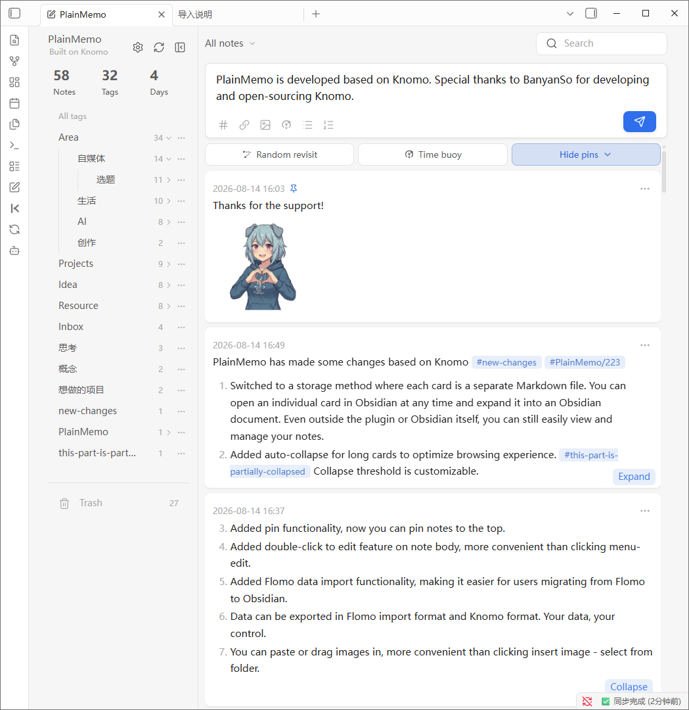
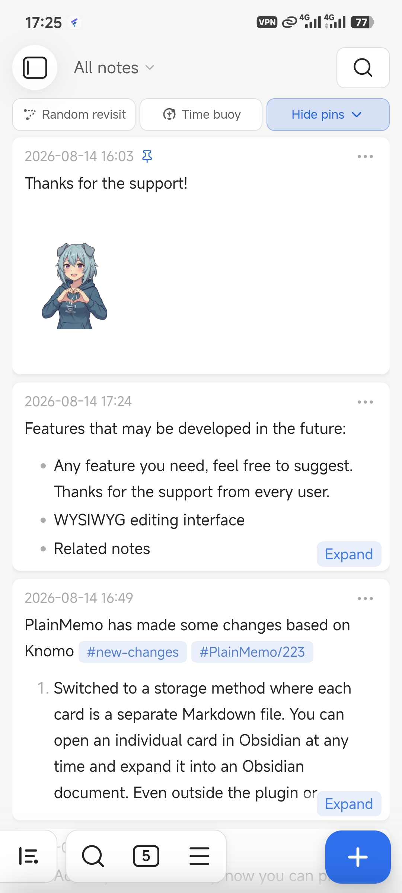
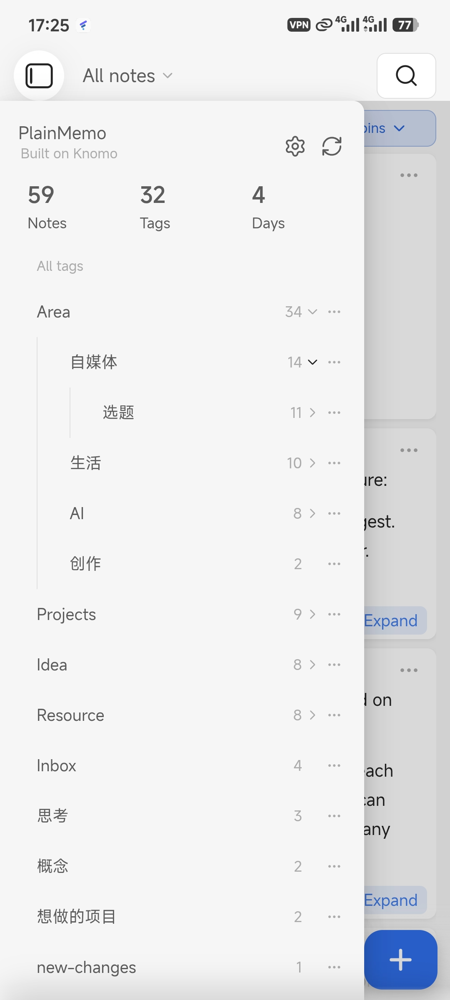
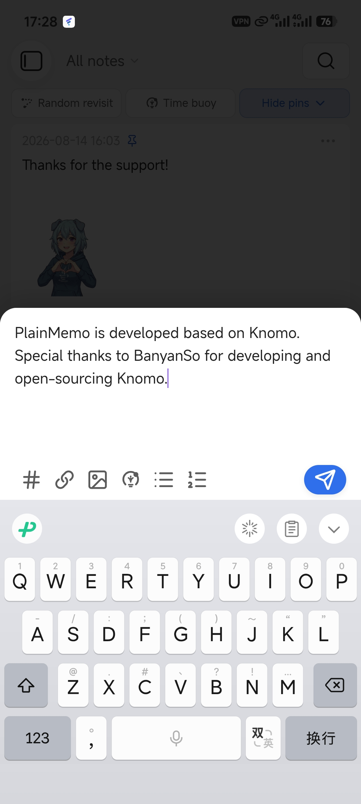

# PlainMemo

English | [简体中文](./README.zh-CN.md)

> PlainMemo is an unofficial fork of [BanyanSo/knomo](https://github.com/BanyanSo/knomo), continued under the upstream MIT license. It is not affiliated with the upstream project. Thanks to the original author for creating Knomo and releasing it under the MIT license.

Current stable release: [PlainMemo 2.2.4](https://github.com/XiaoJie4096/plain-memo/releases/tag/2.2.4)

PlainMemo is a card-based note-taking plugin for Obsidian that helps you capture and manage everyday thoughts. Every memo is stored in your Vault as an independent, ordinary Markdown file, while card browsing, tags, search, images, links, and review remain available. Capture freely without locking notes into a plugin-specific format.

## What it does

| Need | PlainMemo experience |
| --- | --- |
| Capture quickly | Create, edit, delete, search, filter, and revisit notes in a card flow on desktop and mobile. |
| Keep ordinary Markdown files | One memo is one `.md` file, with no YAML or plugin-private markers, so the files remain useful in your file system and other Markdown tools. |
| Connect ideas | Recognize `#tags` and Obsidian WikiLinks; browse hierarchical tags and rename a tag path from the sidebar. |
| Write with Markdown and images | Render lists, tasks, quotes, images, and links; paste images on desktop and mobile, or drag images into the desktop editor. |
| Meet old notes again | Use pinning, Random reunion, Time buoy, and long-note collapsing. |
| Organize and sync | Recursively scan multiple Vault folders and refresh synchronized settings and pin state. |
| Move your data | Prepare existing Markdown files, import from Flomo and Knomo, or export to Flomo and Knomo. |

## Interface preview

### Desktop

<p align="center">
  
</p>

### Mobile

<p align="center">
  
  
  
</p>

## Move your data

- [Import Flomo data into PlainMemo](docs/import-flomo-data.en.md)
- [Import Knomo data into PlainMemo](docs/import-knomo-data.en.md)
- [Export PlainMemo data to Flomo](docs/export-flomo-data.en.md)
- [Export PlainMemo data to Knomo](docs/export-knomo-data.en.md)

## PlainMemo and Knomo

| Area | Knomo | PlainMemo |
| --- | --- | --- |
| Memo storage | Memos live in Daily Notes, with monthly files maintained alongside them | One memo is one ordinary Markdown file |
| File organization | Depends on Daily Notes and monthly files | Scans one or more Vault folders without requiring Daily Notes |
| Content format | Uses Knomo's memo and indexing workflow | The body is complete Markdown, with no YAML or plugin-private markers |
| Migration | Maintains existing Knomo data | Can import Knomo data into independent PlainMemo files and export back to Knomo |

The two projects use different storage models. Existing Knomo Daily Notes and monthly files are not rewritten automatically; back up the Vault first, then use the import guide above when migrating.

## File format

A memo whose body is:

```text
An idea after finishing this book
The second line may contain #reading and [[related notes]].
```

is stored as a file like:

```text
Memos/An idea after finishing this book_2607250855.md
```

- PlainMemo has no separate title field. The first line remains part of the Markdown body and is displayed on the card.
- When creating a memo, the first body line is sanitized and used only as the new filename stem.
- The `_YYMMDDHHmm` suffix records minute-level creation time and provides stable ordering. Same-minute filename conflicts use ` (2)`, ` (3)`, and so on.
- No YAML frontmatter is written; the Markdown file is the sole content source.
- The filename itself is not rendered as an additional card title. Manual filename or body edits become the current source of truth.

## Installation

PlainMemo is not currently published in the Obsidian Community Plugins directory.

### BRAT (recommended)

1. Install and enable [BRAT](https://github.com/TfTHacker/obsidian42-brat) from Obsidian's Community Plugins directory.
2. In BRAT settings, choose **Add Beta plugin** and enter `XiaoJie4096/plain-memo`.
3. Enable PlainMemo in Obsidian's Community Plugins settings.

BRAT installs and updates PlainMemo from the latest stable GitHub Release.

### Manual installation

1. Download `main.js`, `manifest.json`, and `styles.css` from the [latest release](https://github.com/XiaoJie4096/plain-memo/releases/latest).
2. Place the three files in `<vault>/.obsidian/plugins/plain-memo/`.
3. Reload Obsidian and enable PlainMemo under Community Plugins.

## Optional settings

You can start recording immediately after installation and enabling the plugin; no setup is required. PlainMemo creates a `PlainMemo` folder at the Vault root and uses it as the default creation and scan location. `PlainMemo/data` and `PlainMemo/picture` are managed automatically and never shown as memos.

Open PlainMemo settings only when you want to adjust how it works:

1. Add, remove, or change scan folders relative to the Vault root, for example `Memos` or `Inbox/Cards`.
2. Change the default creation folder. New memos are written there, and the folder is automatically included in the scan scope.
3. Optionally adjust the long-card threshold, mobile compact layout, and Time buoy reminders.

## Import existing Markdown files

Each configured scan folder has an import button with the tooltip: "Add a timestamp suffix so PlainMemo can recognize these filenames."

1. Add the folder containing the Markdown files to the scan scope.
2. Click the import button on that folder's settings row and confirm the preview.
3. PlainMemo renames unrecognized `.md` files from `<existing name>.md` to `<existing name>_YYMMDDHHmm.md` using the file's Vault creation time (`ctime`).

Already recognized files are skipped. Markdown content is not changed, name collisions receive a numbered suffix, and renaming goes through Obsidian's file manager so Vault links can be updated.

Files can also be prepared manually by using `<name>_YYMMDDHHmm.md` or `<name>_YYMMDDHHmm (2).md` inside a configured folder.

## Data and privacy

Every memo is an ordinary Markdown file in your Vault. PlainMemo requires no account, relies on no external service, and does not actively upload note content. Scan folders, collapse thresholds, pin markers, random-review records, and shuffle-day history are stored under `PlainMemo/data` so they can synchronize with the Vault. Each pinned memo uses a separate state file to reduce cross-device overwrite conflicts.

Device UI state, including whether the pinned section is collapsed, desktop sidebar geometry, and mobile layout preferences, remains in the local plugin `data.json`.

## Development

```powershell
npm install
npm run typecheck
npm test
npm run build
```

For local testing, copy `main.js`, `manifest.json`, and `styles.css` into the test Vault plugin directory. Do not overwrite `data.json`; it contains each user's own settings.

## Credits and license

PlainMemo uses a one-Markdown-file-per-memo storage model: it does not depend on Daily Notes or monthly archives, recursively scans one or more configured folders, and names files as `<first body line>_YYMMDDHHmm.md`. PlainMemo retains the original copyright and license notices; see [LICENSE](LICENSE).

PlainMemo includes CodeMirror 6, Lezer, and related packages, licensed under MIT. Copyright (C) 2016-2024 by Marijn Haverbeke and others. See [THIRD_PARTY_NOTICES.md](THIRD_PARTY_NOTICES.md) for complete third-party copyright and license notices.
