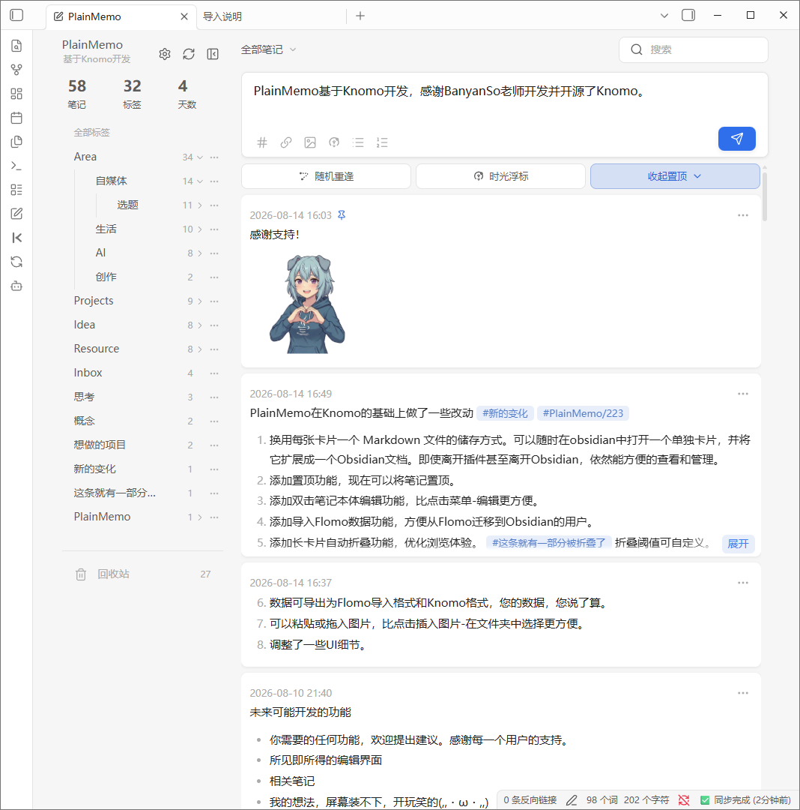
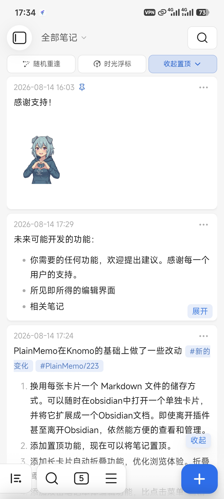
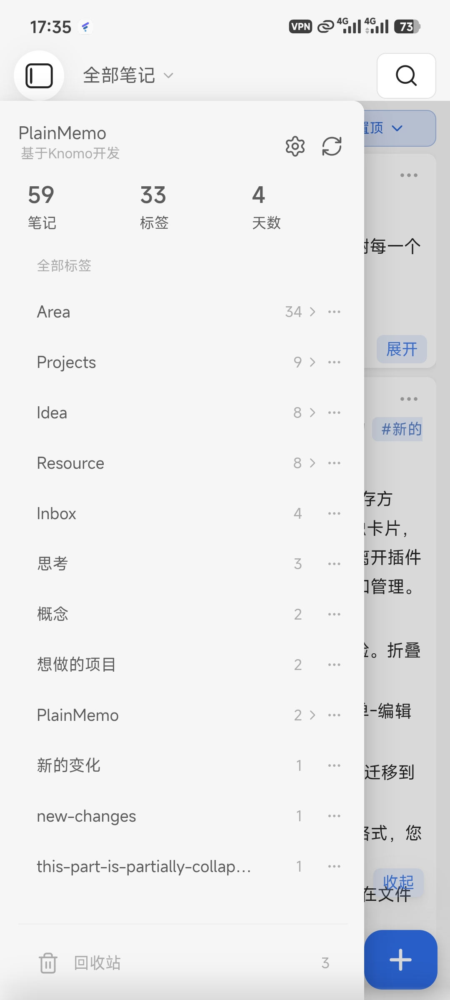

# PlainMemo

[English](./README.md) | 简体中文

> PlainMemo 基于 [BanyanSo/knomo](https://github.com/BanyanSo/knomo) 的 MIT 许可证继续开发，是非官方 fork。感谢原作者创建 Knomo 并将其以 MIT 许可证发布。

当前稳定版本：[PlainMemo 2.3.0](https://github.com/XiaoJie4096/plain-memo/releases/tag/2.3.0)

PlainMemo 是一款运行在 Obsidian 中的卡片笔记插件，用来快速记录和管理日常想法。每条笔记都以独立、普通的 Markdown 文件保存在你的库中，同时拥有卡片流、标签、搜索、图片、链接和回顾功能：既可以随手记录，也不用把笔记困在插件或专用数据格式里。

## 能做什么

| 场景             | PlainMemo 提供的体验                                               |
| -------------- | ------------------------------------------------------------- |
| 快速记录           | 在卡片流中创建、编辑、删除、搜索、筛选和回看笔记；电脑端和手机端都可使用。                         |
| 普通 Markdown 文件 | 一条笔记就是一个 `.md` 文件，不写 YAML 或插件私有标记，可直接在文件系统和其他 Markdown 工具中使用。 |
| 标签与关联          | 识别 `#标签` 和 Obsidian WikiLink；侧栏支持层级标签浏览和重命名。                  |
| Markdown 与图片   | 渲染列表、任务、引用、图片和链接；支持电脑端与手机端粘贴图片，电脑端也可拖入图片。                     |
| 重新遇见笔记         | 支持置顶、随机重逢、时光浮标和长笔记折叠。                                         |
| 多文件夹与同步        | 可递归扫描多个库内文件夹；同步后的置顶状态与设置会自动刷新。                                |
| 数据迁移           | 可整理已有 Markdown 文件名，并支持从 Flomo、Knomo 导入，或导出到 Flomo、Knomo。      |

## 界面预览

### 桌面端

<p align="center">
  
</p>

### 移动端

<p align="center">
  
  
  
</p>

## 数据迁移

- [从 Flomo 导入到 PlainMemo](docs/import-flomo-data.md)
- [从 Knomo 导入到 PlainMemo](docs/import-knomo-data.md)
- [导出 PlainMemo 数据到 Flomo](docs/flomo-import.md)
- [导出 PlainMemo 数据到 Knomo](docs/knomo-import.md)

## PlainMemo 与 Knomo

| 项目   | Knomo                         | PlainMemo                               |
| ---- | ----------------------------- | --------------------------------------- |
| 笔记存储 | Memo 写在 Daily Notes 中，并维护月度文件 | 一条笔记对应一个普通 Markdown 文件                  |
| 文件组织 | 依赖 Daily Notes 与月度文件          | 扫描一个或多个库内文件夹，不依赖 Daily Notes            |
| 内容格式 | 使用 Knomo 的 memo 与索引流程         | 正文就是完整 Markdown，不写 YAML 或插件私有标记         |
| 迁移方式 | 维护既有 Knomo 数据                 | 可从 Knomo 导入为独立 PlainMemo 文件，也可导出回 Knomo |

两者采用不同的存储模型。已有 Knomo 的 Daily Notes 和月度文件不会自动改写；需要迁移时，请先备份库，再使用上方的导入说明。

## 文件格式

一条 memo 的正文为：

```text
读完这本书后的一个想法
第二行也可以包含 #阅读 和 [[相关笔记]]。
```

会保存为类似以下文件：

```text
Memos/读完这本书后的一个想法_2607250855.md
```

- PlainMemo 没有独立标题字段。第一行仍属于 Markdown 正文，并会显示在卡片中。
- 新建 memo 时，插件只会将正文第一行安全化后用作文件名主体。
- 末尾 `_YYMMDDHHmm` 记录分钟级创建时间并用于稳定排序；同一分钟发生文件名冲突时，会追加 ` (2)`、` (3)` 等后缀。
- 不写入 YAML frontmatter；Markdown 文件本身是唯一的内容来源。
- 文件名不会作为额外的卡片标题显示。手动修改文件名或正文后，当前文件就是新的事实来源。

## 安装

PlainMemo 目前尚未发布到 Obsidian 社区插件市场。

### 使用 BRAT（推荐）

1. 从 Obsidian 社区插件市场安装并启用 [BRAT](https://github.com/TfTHacker/obsidian42-brat)。
2. 在 BRAT 设置中选择“Add Beta plugin”，输入 `XiaoJie4096/plain-memo`。
3. 在 Obsidian 的“第三方插件”中启用 PlainMemo。

BRAT 会从 GitHub 最新的稳定 Release 安装和更新 PlainMemo。

### 手动安装

1. 从[最新发行版](https://github.com/XiaoJie4096/plain-memo/releases/latest)下载 `main.js`、`manifest.json` 和 `styles.css`。
2. 将这三个文件放入 `<Vault>/.obsidian/plugins/plain-memo/`。
3. 重新加载 Obsidian，然后在“第三方插件”中启用 PlainMemo。

## 可选设置

安装并启用后即可直接开始记录，不需要先配置。PlainMemo 会在库根目录创建 `PlainMemo` 文件夹，并将它作为默认新建位置和扫描范围；`PlainMemo/data` 与 `PlainMemo/picture` 由插件自动管理，不会显示为笔记。

只有在需要调整使用方式时，再打开 PlainMemo 设置：

1. 添加、删除或修改一个或多个扫描文件夹，路径相对于库根目录，例如 `Memos` 或 `收集箱/卡片`。
2. 修改“默认新建位置”。新笔记会写入这里，该文件夹也会自动加入扫描范围。
3. 按需调整长卡片折叠阈值、移动端紧凑布局和时光浮标。

## 导入已有 Markdown 文件

每个已配置的扫描文件夹旁都有一个导入按钮，提示文字是：“给文件名添加时间后缀，让它能被 PlainMemo 识别。”

1. 先把存放 Markdown 文件的文件夹加入扫描范围。
2. 点击该文件夹设置行上的导入按钮，查看预览并确认。
3. PlainMemo 会使用文件在 Vault 中的创建时间（`ctime`），将未识别的 `<原文件名>.md` 重命名为 `<原文件名>_YYMMDDHHmm.md`。

已经符合规则的文件会被跳过。Markdown 正文不会改变；发生重名时会追加数字后缀；重命名通过 Obsidian 文件管理接口完成，因此 Vault 内相关链接可以随之更新。

也可以手工整理文件名。在配置的文件夹中使用 `<名称>_YYMMDDHHmm.md` 或 `<名称>_YYMMDDHHmm (2).md` 即可。

## 数据与隐私

所有 memo 都是 Vault 内的普通 Markdown 文件。PlainMemo 不要求账号、不依赖外部服务器，也不会主动上传笔记内容。扫描目录、折叠阈值、置顶标记、随机回顾记录和往日漫游历史保存在 `PlainMemo/data` 中，可以和 Vault 一起同步。每条置顶笔记使用一个独立状态文件，减少多设备同时修改时相互覆盖的风险。

置顶区折叠状态、桌面侧栏宽度和移动端布局等设备界面状态仍保存在本机插件 `data.json` 中，不参与 PlainMemo 的共享状态同步。

## 开发

```powershell
npm install
npm run typecheck
npm test
npm run build
```

开发完成后，将构建产物 `main.js`、`manifest.json`、`styles.css` 复制到测试 Vault 的插件目录。不要覆盖该目录中的 `data.json`，以免覆盖用户自己的设置。

## 致谢与许可证

PlainMemo 将存储模型改为“一条笔记一个 Markdown 文件”：不依赖 Daily Notes 或月度归档，递归扫描用户配置的一个或多个文件夹，并使用 `<正文首行>_YYMMDDHHmm.md` 作为文件名。PlainMemo 保留原有版权与许可证声明；详情见 [LICENSE](LICENSE)。

PlainMemo 使用了 CodeMirror 6、Lezer 及其相关组件，采用 MIT 许可证。Copyright (C) 2016-2024 by Marijn Haverbeke and others。完整的第三方版权与许可证声明请见 [THIRD_PARTY_NOTICES.md](THIRD_PARTY_NOTICES.md)。
